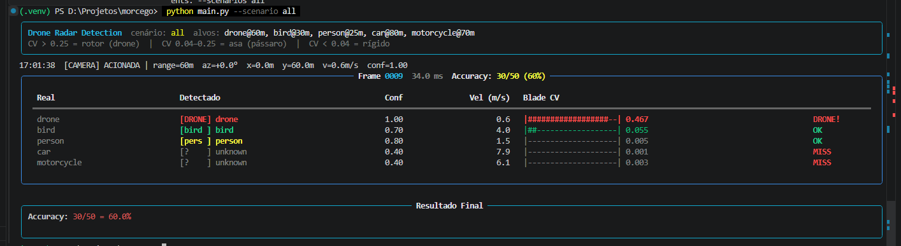

# Morcego — Radar de Detecção de Drones

Pipeline de detecção de objetos via radar FMCW 77 GHz, com foco em identificar **drones** e distingui-los de pássaros, veículos e pedestres — sem câmera, sem GPU, sem deep learning.

---

## Demo



---

## O problema

Drones não autorizados são invisíveis para câmeras à noite, em neblina ou a distâncias maiores. Radares detectam qualquer coisa que reflita ondas — mas o desafio é distinguir drone de pássaro, carro ou pessoa sem gerar falsos alarmes.

## A solução — o discriminador físico

A física resolve o problema: pás giratórias criam uma assinatura de **micro-Doppler** que nenhum outro alvo reproduz.

Quando um drone voa, seus rotores giram a 80–250 Hz. Isso modula a amplitude do sinal radar ~150 vezes por segundo — como uma "impressão digital" no sinal. O sistema mede isso com o **Blade CV** (coeficiente de variação da amplitude):

| Alvo         | Blade CV | Motivo                          |
|--------------|----------|---------------------------------|
| Drone        | ~0.47    | 46% de variação — rotor dominante |
| Pássaro      | ~0.05    | Batida lenta de asas            |
| Carro/pessoa | ~0.001   | Corpo rígido, zero modulação    |

Três ordens de magnitude de diferença. É o que torna a detecção confiável.

---

## Por que roda num Raspberry Pi Zero 2?

O pipeline é todo em NumPy/Python puro — sem GPU, sem deep learning. A etapa mais pesada é a FFT 2D:

- **Laptop**: ~7 ms por frame
- **RPi Zero 2** (5× mais lento): ~35 ms → **~28 fps** — suficiente para detecção em tempo real

---

## Instalação

```bash
git clone https://github.com/seu-usuario/morcego.git
cd morcego

python -m venv .venv
# Windows:
.venv\Scripts\Activate.ps1
# Linux/macOS:
source .venv/bin/activate

pip install -r requirements.txt
```

**Dependências:** `numpy`, `scipy`, `matplotlib`, `rich`

---

## Uso

```bash
# Cenário completo (drone + pássaro + carro + pessoa)
python main.py --scenarios all

# Apenas veículos — esperado zero falsos positivos
python main.py --scenario no_drone

# Drone pequeno entre pássaros (pior caso)
python main.py --scenario clutter

# Condições ruins de sinal (SNR = 5 dB)
python main.py --scenario all --snr 5

# Benchmark de performance
python main.py --scenario all --benchmark

# Gerar gráfico visual do Blade CV por classe
python demo_plot.py
```

### Cenários disponíveis

| Cenário      | Descrição                                           |
|--------------|-----------------------------------------------------|
| `drone`      | Drone pairando                                      |
| `bird`       | Pássaro lento                                       |
| `person`     | Pedestre                                            |
| `car`        | Veículo lento                                       |
| `motorcycle` | Motocicleta                                         |
| `all`        | Drone + pássaro + pedestre + carro + moto           |
| `urban`      | Cenário urbano: dois drones + trânsito + pedestres  |
| `clutter`    | Drone pequeno entre vários pássaros                 |
| `multi_drone`| Três drones simultâneos                             |
| `no_drone`   | Apenas veículos (teste de falsos positivos)         |
| `hard`       | Drone de carga próximo de pássaros grandes          |

### Alvos customizados

```bash
# Combinar alvos manualmente
python main.py --targets drone_hovering bird_fast car_highway
```

---

## Estrutura do projeto

```
morcego/
├── main.py             # Ponto de entrada — orquestra o pipeline
├── radar_sim.py        # Simulador FMCW 77 GHz (sinal IQ + ruído)
├── feature_extractor.py# Extração de velocidade, potência e Blade CV
├── classifier.py       # Classificador por limiares físicos
├── tracker.py          # Rastreamento com filtro de Kalman
├── scenarios.py        # Definição de alvos e cenários de teste
├── display.py          # Interface visual no terminal (rich)
├── alert.py            # Sistema de alertas (mock / HTTP / GPIO)
├── demo_plot.py        # Gráfico de barras do Blade CV por classe
├── visualizer.py       # Visualizações auxiliares
└── requirements.txt
```

---

## Desenvolvido por Vinicius A. de Moraes